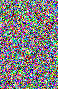

# Evolutionary Convergence Visualizer
This is based on an evolutionary algoritm writen by my dear friend @hotwiner.  
It was written to observe the convergence of a random string into the target string using an evolutionary algorithm.  
I have modified the algorithm so that the target string is the rgb-pixel value sequence of an image.  
This way the transformation of a random bitmap into the target bitmap over generations can be observed visually.  
As fitness-score distance to the target value is taken and the two highest scoring specimens are crossed.  
Then the resulting offsprings are mutated and re-evaluated.  
This goes on until an offsprings string matches that of the original image.

# Example
 
| Charles Darwin  | |
| :-----: | ------------- |
|   | Here is a painting of Charles Darwin.    It took 588 Generations to achieve the original image.  |

# Requirements
- Linux
- NETPBM (must be in PATH to be called from terminal)
- Gifsicle (must be in PATH to be called from terminal)
- Python

# How to run?
1. Call `python gen.py` from terminal while inside the folder
2. Enter the name of the png file (with the extention)
3. Wait (it takes quiet a long time if the image is large, better choose a small one)
4. You can watch the evolution of the image under result.gif, once you get "Number of generation: ..." message. Each frame (except the last) means 10 generations!
5. You can clean the frames and leftover files in the folder using the command `make clean`.
